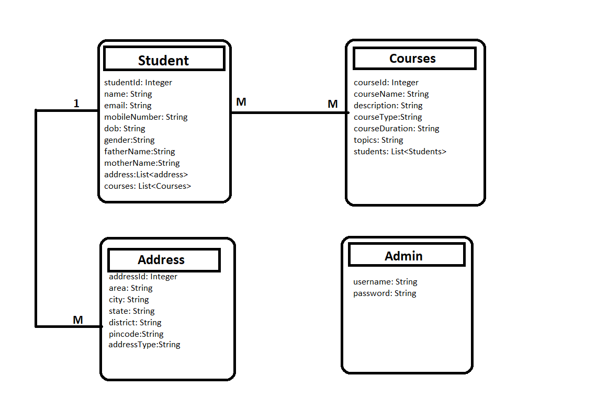

# OOP-N03_25_26_PHONG_DUONG
PHONG_DUONG_OUR_PROJECT
# Project: Quản lý sinh viên

## Mô tả các đối tượng và CRUD

### 1. Sinh viên (Student)
- **Tạo (Create)**: Tạo mới một sinh viên và thêm vào danh sách.
- **Đọc (Read)**: Lấy thông tin sinh viên theo ID.
- **Sửa (Edit)**: Cập nhật thông tin sinh viên.
- **Xóa (Delete)**: Xóa sinh viên khỏi danh sách.

### 2. Khóa học (Course)
- **Tạo (Create)**: Tạo mới một khóa học và thêm vào danh sách.
- **Đọc (Read)**: Lấy thông tin khóa học theo ID.
- **Sửa (Edit)**: Cập nhật thông tin khóa học.
- **Xóa (Delete)**: Xóa khóa học khỏi danh sách.

### 3. Địa chỉ (Address)
- **Tạo (Create)**: Tạo mới một địa chỉ và thêm vào danh sách.
- **Đọc (Read)**: Lấy thông tin địa chỉ theo ID.
- **Sửa (Edit)**: Cập nhật thông tin địa chỉ.
- **Xóa (Delete)**: Xóa địa chỉ khỏi danh sách.

## Sơ đồ thuật toán
